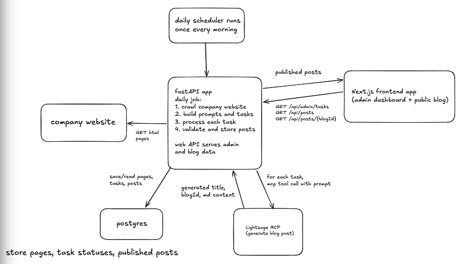

# Autoblog MVP



*system architecture*

A deterministic content-operations demo built with Next.js 16, React 19, Prisma, and PostgreSQL. An admin can start a publishing run, watch posts move from queued to generating to filed, review prior runs, and archive posts without deleting their history. Published posts appear on the public blog with category filters and SEO metadata.

The content and engagement metrics are simulated. There is no external AI or analytics service in this MVP.

This demo does not include authentication or authorization. Add an authenticated admin boundary before exposing the admin pages or mutation APIs on a public deployment.

## Local setup

Requirements: Node.js 20.9+, pnpm 10+, and Docker.

```bash
pnpm dev
```

That one command creates `.env` when needed, installs dependencies, starts
PostgreSQL, applies migrations, seeds the required authors, and starts the
Next.js development server. Each step is safe to run again on later starts.

Open [http://localhost:3000](http://localhost:3000) for the blog or [http://localhost:3000/admin](http://localhost:3000/admin) for content operations.

## Quality checks

```bash
pnpm check
pnpm build
```

Integration tests use the PostgreSQL database configured by `DATABASE_URL` and reset the run, task, and post tables. Use a dedicated local or CI database; do not point the test command at production data.

## Main modules

- `app/(blog)`: server-rendered public blog and article pages
- `app/(admin)`: server-rendered admin entry points with small client islands for polling, streaming, and mutations
- `app/api`: route handlers used by those interactive client islands
- `lib/tasks.ts`: run orchestration and task read models
- `lib/posts.ts`: publishing queries and archive mutation
- `lib/content-generator.ts`: deterministic demo content provider
- `prisma`: schema, migrations, and author seed data

Set `NEXT_PUBLIC_SITE_URL` in production so canonical URLs, the sitemap, and `llms.txt` use the deployed origin.
